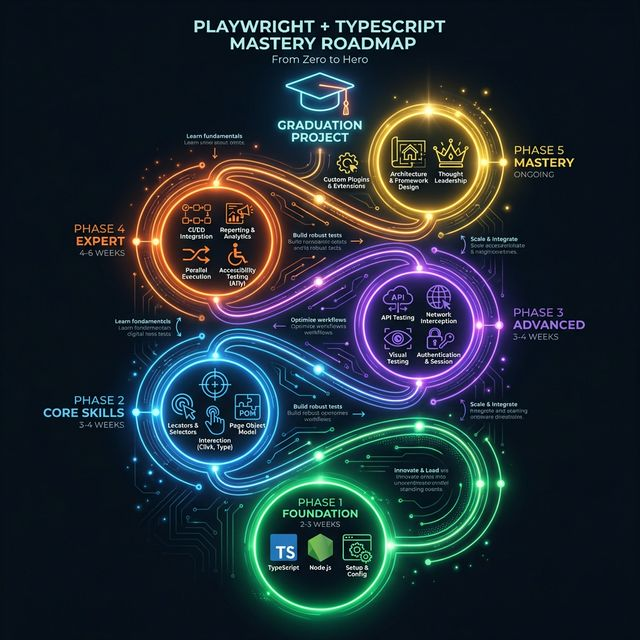
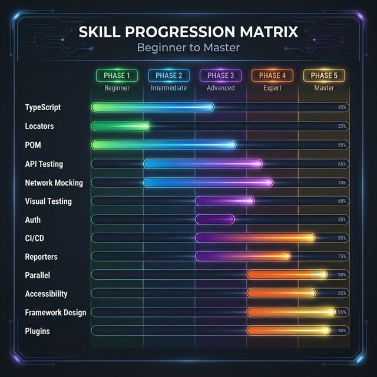
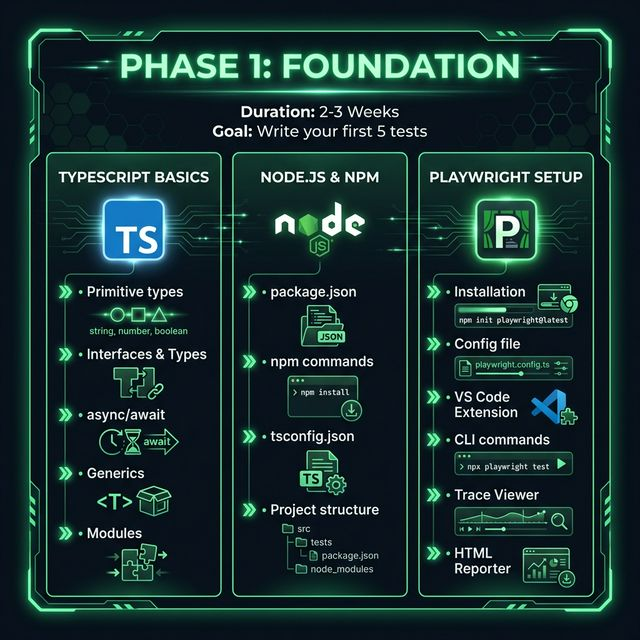
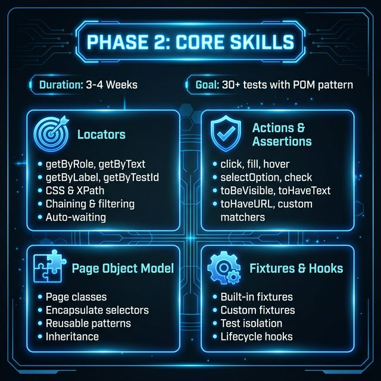
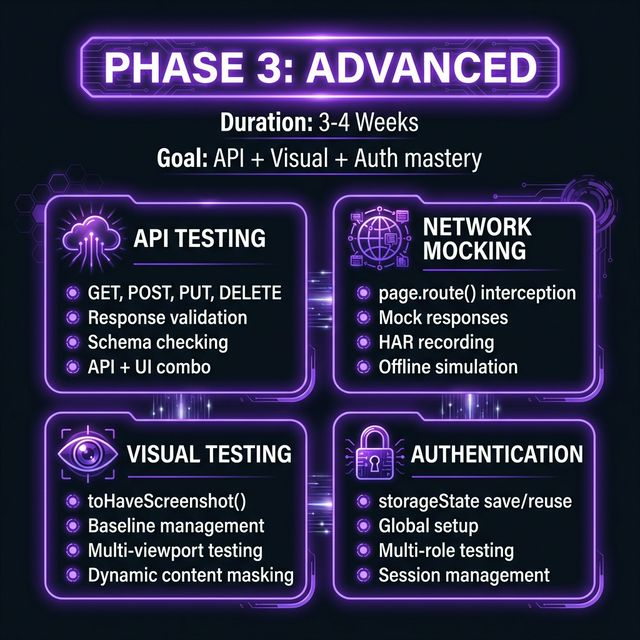
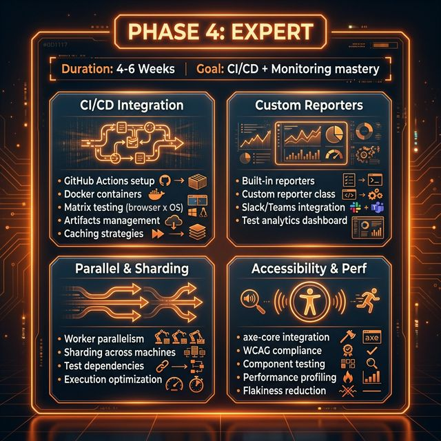
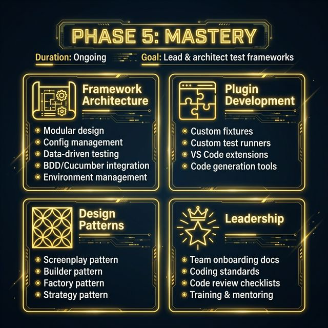
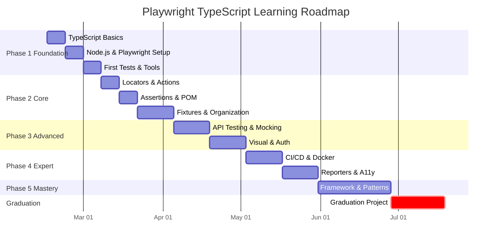

# 🎭 Playwright + TypeScript Mastery Roadmap

> **Từ Zero đến Hero** — Hướng dẫn học Playwright với TypeScript chi tiết, có lộ trình, bài tập và checklist theo từng giai đoạn.

---

## 📍 Tổng Quan Roadmap





### Tổng Thời Gian Ước Tính: **16–23 tuần** (~4–6 tháng)

| Phase | Tên | Thời gian | Mục tiêu chính |
|:-----:|-----|:---------:|----------------|
| 1 | Foundation | 2–3 tuần | Setup, viết test đầu tiên |
| 2 | Core Skills | 3–4 tuần | POM, Locators, 30+ tests |
| 3 | Advanced | 3–4 tuần | API, Visual, Auth |
| 4 | Expert | 4–6 tuần | CI/CD, Reporters, A11y |
| 5 | Mastery | ongoing | Framework design, leadership |
| 🎓 | Graduation | 3 tuần | E-Commerce framework hoàn chỉnh |

---

## 📚 Tài Liệu Tham Khảo Tổng Hợp

### Official Documentation

| Tài liệu | Link |
|-----------|------|
| Playwright Docs | [playwright.dev](https://playwright.dev/) |
| Playwright API Reference | [API Classes](https://playwright.dev/docs/api/class-playwright) |
| TypeScript Handbook | [typescriptlang.org](https://www.typescriptlang.org/docs/handbook/intro.html) |
| Node.js Docs | [nodejs.org](https://nodejs.org/en/docs/) |
| Playwright Best Practices | [Best Practices](https://playwright.dev/docs/best-practices) |
| Playwright Changelog | [Releases](https://github.com/microsoft/playwright/releases) |

### GitHub Repos

| Repo | Mô tả |
|------|--------|
| [microsoft/playwright](https://github.com/microsoft/playwright) | Source code chính thức |
| [awesome-playwright](https://github.com/mxschmitt/awesome-playwright) | Tổng hợp tài nguyên Playwright |
| [playwright-community](https://github.com/playwright-community) | Community plugins & tools |
| [playwright-test-coverage](https://github.com/nicolo-ribaudo/playwright-test-coverage) | Code coverage cho Playwright |
| [playwright-solutions](https://github.com/nickmccurdy/playwright-solutions) | Ví dụ & solutions |

### Video / Khóa Học

| Nguồn | Link |
|-------|------|
| Playwright Official YouTube | [youtube.com/@playwright](https://www.youtube.com/@playwright) |
| LambdaTest Playlist | [Playwright Tutorial Series](https://www.youtube.com/playlist?list=PLZMWkkQEwOPn68qzApiZVMv1RxNA3gams) |
| Automation Step by Step | [youtube.com/@automationstepbystep](https://www.youtube.com/@automationstepbystep) |
| Commit Quality | [youtube.com/@commitquality](https://www.youtube.com/@commitquality) |
| Udemy - Playwright TS | [Udemy Playwright](https://www.udemy.com/topic/playwright/) |
| Test Automation University | [Free Courses](https://testautomationu.applitools.com/) |

### Practice Websites

| Website | Dùng ở Phase |
|---------|:------------:|
| [demo.playwright.dev/todomvc](https://demo.playwright.dev/todomvc/) | 1 |
| [saucedemo.com](https://www.saucedemo.com/) | 2 |
| [demoqa.com](https://demoqa.com/) | 2 |
| [the-internet.herokuapp.com](https://the-internet.herokuapp.com/) | 2, 3 |
| [reqres.in](https://reqres.in/) | 3 |
| [jsonplaceholder.typicode.com](https://jsonplaceholder.typicode.com/) | 3 |
| [automationexercise.com](https://automationexercise.com/) | 🎓 |
| [opencart.abstracta.us](https://opencart.abstracta.us/) | 🎓 |

---

## 🟢 Phase 1: Foundation (Tuần 1–3)



> **Mục tiêu:** Nắm vững TypeScript cơ bản, cài đặt Playwright, viết được test đầu tiên.

### 📖 1.1 — TypeScript Fundamentals

**Tại sao cần TypeScript?** Playwright hỗ trợ TS native — bạn được autocompletion, type checking, refactoring an toàn hơn JavaScript thuần.

#### Kiến thức bắt buộc:

```typescript
// 1. Kiểu dữ liệu cơ bản
let name: string = "Playwright";
let version: number = 1.50;
let isAwesome: boolean = true;
let browsers: string[] = ["chromium", "firefox", "webkit"];

// 2. Interface — mô tả hình dạng object
interface TestConfig {
  baseURL: string;
  timeout: number;
  retries?: number; // optional property
}

// 3. Type alias — union types, intersection
type BrowserName = "chromium" | "firefox" | "webkit";
type TestResult = "passed" | "failed" | "skipped";

// 4. Enum
enum TestStatus {
  PASSED = "passed",
  FAILED = "failed",
  SKIPPED = "skipped",
}

// 5. async/await — CỰC KỲ QUAN TRỌNG cho Playwright
async function runTest(): Promise<void> {
  const response = await fetch("https://api.example.com/data");
  const data = await response.json();
  console.log(data);
}

// 6. Generics
function getFirst<T>(items: T[]): T {
  return items[0];
}

// 7. Module system
// file: utils.ts
export function formatTestName(name: string): string {
  return name.toLowerCase().replace(/\s+/g, "-");
}
// file: test.ts
import { formatTestName } from "./utils";
```

#### Tài liệu TypeScript:
- 📖 [TS Handbook: The Basics](https://www.typescriptlang.org/docs/handbook/2/basic-types.html)
- 📖 [TS Handbook: Everyday Types](https://www.typescriptlang.org/docs/handbook/2/everyday-types.html)
- 📖 [TS Handbook: Narrowing](https://www.typescriptlang.org/docs/handbook/2/narrowing.html)
- 🎯 [Exercism TS Track](https://exercism.org/tracks/typescript) — Luyện tập miễn phí

### 📖 1.2 — Node.js & npm Basics

```bash
# Kiểm tra version
node --version   # >= 18.x
npm --version    # >= 9.x

# Khởi tạo project
mkdir playwright-learning && cd playwright-learning
npm init -y

# Cấu trúc tsconfig.json cơ bản
npx tsc --init
```

**File `tsconfig.json`** quan trọng:
```json
{
  "compilerOptions": {
    "target": "ES2022",
    "module": "commonjs",
    "strict": true,
    "esModuleInterop": true,
    "outDir": "./dist",
    "rootDir": "./src"
  }
}
```

### 📖 1.3 — Playwright Setup & Cấu Trúc Project

```bash
# Cài đặt Playwright (CÁCH CHÍNH THỨC)
npm init playwright@latest

# Playwright sẽ tạo cấu trúc:
# ├── tests/              ← Nơi viết test
# │   └── example.spec.ts
# ├── tests-examples/     ← Ví dụ mẫu
# ├── playwright.config.ts ← Config chính
# ├── package.json
# └── tsconfig.json
```

**File `playwright.config.ts` — Hiểu từng dòng:**
```typescript
import { defineConfig, devices } from "@playwright/test";

export default defineConfig({
  // Thư mục chứa test files
  testDir: "./tests",

  // Chạy tests trong file song song
  fullyParallel: true,

  // Fail CI nếu có test.only
  forbidOnly: !!process.env.CI,

  // Số lần retry khi fail
  retries: process.env.CI ? 2 : 0,

  // Số workers chạy song song
  workers: process.env.CI ? 1 : undefined,

  // Reporter — hiển thị kết quả
  reporter: "html",

  // Cài đặt chung cho tất cả tests
  use: {
    baseURL: "http://localhost:3000",
    trace: "on-first-retry",      // Ghi trace khi retry
    screenshot: "only-on-failure", // Chụp màn hình khi fail
    video: "retain-on-failure",    // Quay video khi fail
  },

  // Danh sách browser projects
  projects: [
    {
      name: "chromium",
      use: { ...devices["Desktop Chrome"] },
    },
    {
      name: "firefox",
      use: { ...devices["Desktop Firefox"] },
    },
    {
      name: "webkit",
      use: { ...devices["Desktop Safari"] },
    },
  ],
});
```

**CLI Commands cần nhớ:**
```bash
npx playwright test                    # Chạy tất cả
npx playwright test --headed           # Có giao diện
npx playwright test --debug            # Debug mode
npx playwright test --ui               # UI mode (interactive)
npx playwright test tests/login.spec.ts # Chạy 1 file
npx playwright test -g "should login"  # Chạy theo tên
npx playwright test --project=chromium # 1 browser
npx playwright show-report             # Xem HTML report
npx playwright codegen https://example.com  # Record test
```

### 📖 1.4 — Viết Test Đầu Tiên

```typescript
// tests/my-first-test.spec.ts
import { test, expect } from "@playwright/test";

// test() — khai báo test case
test("should have correct title", async ({ page }) => {
  // 1. Navigate
  await page.goto("https://playwright.dev");

  // 2. Assert
  await expect(page).toHaveTitle(/Playwright/);
});

// test.describe() — nhóm test liên quan
test.describe("Homepage", () => {
  // beforeEach — chạy trước MỖI test trong group
  test.beforeEach(async ({ page }) => {
    await page.goto("https://playwright.dev");
  });

  test("should have Get Started link", async ({ page }) => {
    const getStarted = page.getByRole("link", { name: "Get started" });
    await expect(getStarted).toBeVisible();
  });

  test("should navigate to docs", async ({ page }) => {
    await page.getByRole("link", { name: "Get started" }).click();
    await expect(page).toHaveURL(/.*intro/);
  });
});

// Lifecycle hooks
test.describe("Lifecycle demo", () => {
  test.beforeAll(async () => {
    console.log("Chạy 1 lần trước TẤT CẢ tests");
  });
  test.beforeEach(async ({ page }) => {
    console.log("Chạy trước MỖI test");
  });
  test.afterEach(async ({ page }) => {
    console.log("Chạy sau MỖI test");
  });
  test.afterAll(async () => {
    console.log("Chạy 1 lần sau TẤT CẢ tests");
  });

  test("example", async ({ page }) => {
    // ...
  });
});
```

### ✅ Checklist Phase 1

- [ ] Cài đặt Node.js (v18+) và npm
- [ ] Hoàn thành ít nhất 10 bài TypeScript trên Exercism
- [ ] Hiểu `async/await`, Promise, `interface`, `type`, `enum`
- [ ] Hiểu module system (`import`/`export`)
- [ ] Cài đặt Playwright thành công (`npm init playwright@latest`)
- [ ] Hiểu cấu trúc folder Playwright project
- [ ] Đọc và hiểu từng option trong `playwright.config.ts`
- [ ] Viết và chạy được 5 test cases đầu tiên
- [ ] Sử dụng `test.describe()`, `beforeEach`, `afterEach`
- [ ] Chạy test bằng CLI: `--headed`, `--debug`, `--ui`
- [ ] Sử dụng Playwright VS Code Extension (test runner, test generator)
- [ ] Mở được Trace Viewer → hiểu cách đọc trace
- [ ] Mở được HTML Report → hiểu cách đọc report
- [ ] Sử dụng `npx playwright codegen` để record 1 test

### 🏋️ Bài Tập Phase 1

#### BT 1.1 — Hello Playwright ⭐
```
Mức độ: Dễ | Thời gian: 1-2 giờ
Website: https://playwright.dev

Yêu cầu:
  1. Tạo project Playwright hoàn toàn mới
  2. Viết test verify title trang chủ chứa "Playwright"
  3. Chụp screenshot trang chủ → lưu vào folder screenshots/
  4. Click "Get Started" → verify URL chứa "/docs/intro"
  5. Chạy test trên cả 3 browsers (Chromium, Firefox, WebKit)

Output: 3 tests, 3 screenshots, pass trên 3 browsers
```

#### BT 1.2 — Wikipedia Search ⭐⭐
```
Mức độ: Trung bình | Thời gian: 2-3 giờ
Website: https://en.wikipedia.org

Yêu cầu:
  1. Dùng beforeEach navigate đến Wikipedia
  2. Tìm kiếm "TypeScript" → verify title bài viết
  3. Tìm kiếm "Playwright (software)" → verify heading
  4. Verify bài viết chứa text "Microsoft"
  5. Click vào 1 internal link → verify navigation
  6. Test thay đổi ngôn ngữ (English → Vietnamese)

Output: 5+ tests, sử dụng describe + beforeEach
```

#### BT 1.3 — TodoMVC Full Testing ⭐⭐⭐
```
Mức độ: Thử thách | Thời gian: 3-4 giờ
Website: https://demo.playwright.dev/todomvc/

Yêu cầu:
  1. Thêm 5 todo items → verify count hiển thị "5 items left"
  2. Đánh dấu 2 items completed → verify "3 items left"
  3. Filter "Active" → chỉ thấy 3 items
  4. Filter "Completed" → chỉ thấy 2 items
  5. Xóa 1 completed item → verify chỉ còn 1 completed
  6. "Clear completed" → verify tất cả completed biến mất
  7. Double-click để edit 1 todo → verify text mới
  8. Check/uncheck "Toggle all"

Output: 8+ tests có tổ chức trong describe blocks
```

---

## 🔵 Phase 2: Core Skills (Tuần 4–7)



> **Mục tiêu:** Thành thạo Locators, Actions, Assertions, Page Object Model, Fixtures.

### 📖 2.1 — Locators & Selectors Chi Tiết

**Quy tắc vàng:** Luôn ưu tiên **user-facing locators** trước CSS/XPath.

```typescript
// ✅ RECOMMENDED — User-facing locators (ưu tiên cao → thấp)
// 1. getByRole — TỐT NHẤT, dựa trên accessibility role
page.getByRole("button", { name: "Submit" });
page.getByRole("heading", { name: "Welcome", level: 1 });
page.getByRole("link", { name: "Sign in" });
page.getByRole("textbox", { name: "Email" });
page.getByRole("checkbox", { name: "Remember me" });
page.getByRole("combobox", { name: "Country" });
page.getByRole("tab", { name: "Settings" });
page.getByRole("dialog"); // modal/dialog

// 2. getByText — tìm theo visible text
page.getByText("Welcome back!");
page.getByText("Welcome", { exact: false }); // partial match
page.getByText(/welcome/i); // regex, case-insensitive

// 3. getByLabel — form fields có label
page.getByLabel("Email address");
page.getByLabel("Password");

// 4. getByPlaceholder — form fields có placeholder
page.getByPlaceholder("Enter your email");

// 5. getByAltText — images
page.getByAltText("Company logo");

// 6. getByTitle — title attribute
page.getByTitle("Close dialog");

// 7. getByTestId — data-testid attribute (fallback)
page.getByTestId("submit-button");

// ⚠️ AVOID — CSS/XPath nên là lựa chọn cuối
page.locator("#submit-btn");           // CSS ID
page.locator(".btn-primary");          // CSS class
page.locator('input[type="email"]');   // CSS attribute
page.locator("//div[@class='card']");  // XPath

// 🔗 CHAINING — kết hợp locators
// Tìm button "Delete" TRONG row có text "John"
page.getByRole("row", { name: "John" })
    .getByRole("button", { name: "Delete" });

// Filter locators
page.getByRole("listitem")
    .filter({ hasText: "Product 1" })
    .getByRole("button", { name: "Add to cart" });

// nth, first, last
page.getByRole("listitem").nth(2);    // item thứ 3 (0-indexed)
page.getByRole("listitem").first();
page.getByRole("listitem").last();

// has — filter có chứa child element
page.getByRole("listitem").filter({
  has: page.getByRole("heading", { name: "Featured" })
});
```

> 📎 [Locators Guide](https://playwright.dev/docs/locators) | [Auto-waiting](https://playwright.dev/docs/actionability)

### 📖 2.2 — Actions Chi Tiết

```typescript
// === CLICK ACTIONS ===
await page.getByRole("button", { name: "Submit" }).click();
await page.getByRole("button").dblclick();     // Double click
await page.getByRole("button").click({ button: "right" }); // Right click
await page.getByRole("button").click({ force: true }); // Bỏ qua actionability checks
await page.getByRole("button").click({ position: { x: 10, y: 20 } });

// === TEXT INPUT ===
await page.getByLabel("Email").fill("user@test.com"); // Clear rồi nhập
await page.getByLabel("Email").clear();                // Xóa nội dung
await page.getByLabel("Email").pressSequentially("hello", { delay: 100 }); // Gõ từng ký tự

// === SELECT / DROPDOWN ===
await page.getByLabel("Country").selectOption("vietnam");            // by value
await page.getByLabel("Country").selectOption({ label: "Vietnam" }); // by label
await page.getByLabel("Country").selectOption(["us", "uk"]);         // multi-select

// === CHECKBOX / RADIO ===
await page.getByRole("checkbox", { name: "Agree" }).check();
await page.getByRole("checkbox", { name: "Agree" }).uncheck();
await page.getByRole("checkbox", { name: "Agree" }).setChecked(true);
await page.getByRole("radio", { name: "Express" }).check();

// === HOVER ===
await page.getByRole("link", { name: "Products" }).hover();

// === KEYBOARD ===
await page.keyboard.press("Enter");
await page.keyboard.press("Control+A");
await page.keyboard.press("Meta+C"); // Cmd+C trên Mac
await page.getByLabel("Search").press("Enter");

// === FILE UPLOAD ===
await page.getByLabel("Upload").setInputFiles("file.pdf");
await page.getByLabel("Upload").setInputFiles(["file1.pdf", "file2.pdf"]);
await page.getByLabel("Upload").setInputFiles([]); // Clear files

// === DRAG AND DROP ===
await page.getByText("Drag me").dragTo(page.getByText("Drop here"));

// === FRAMES / IFRAMES ===
const frame = page.frameLocator("#my-iframe");
await frame.getByRole("button", { name: "Click" }).click();

// === DIALOGS (Alert, Confirm, Prompt) ===
page.on("dialog", async (dialog) => {
  console.log(dialog.message());
  await dialog.accept();       // OK
  // await dialog.dismiss();   // Cancel
  // await dialog.accept("input value"); // Prompt
});
await page.getByRole("button", { name: "Show Alert" }).click();

// === NEW TAB / POPUP ===
const [newPage] = await Promise.all([
  page.waitForEvent("popup"),
  page.getByRole("link", { name: "Open new tab" }).click(),
]);
await expect(newPage).toHaveTitle("New Page");
```

> 📎 [Input Guide](https://playwright.dev/docs/input) | [Dialogs](https://playwright.dev/docs/dialogs)

### 📖 2.3 — Assertions Chi Tiết

```typescript
import { test, expect } from "@playwright/test";

// === PAGE ASSERTIONS ===
await expect(page).toHaveTitle("Home Page");
await expect(page).toHaveTitle(/home/i);        // regex
await expect(page).toHaveURL("https://example.com/dashboard");
await expect(page).toHaveURL(/dashboard/);

// === LOCATOR ASSERTIONS — Visibility ===
await expect(page.getByText("Success")).toBeVisible();
await expect(page.getByText("Loading")).toBeHidden();
await expect(page.getByText("Error")).not.toBeVisible(); // negation

// === LOCATOR ASSERTIONS — Text ===
await expect(page.getByRole("heading")).toHaveText("Welcome");
await expect(page.getByRole("heading")).toContainText("Wel");
await expect(page.getByRole("alert")).toHaveText(/error/i);

// === LOCATOR ASSERTIONS — State ===
await expect(page.getByRole("button")).toBeEnabled();
await expect(page.getByRole("button")).toBeDisabled();
await expect(page.getByRole("checkbox")).toBeChecked();
await expect(page.getByRole("checkbox")).not.toBeChecked();
await expect(page.getByRole("textbox")).toBeFocused();
await expect(page.getByRole("textbox")).toBeEditable();
await expect(page.getByRole("textbox")).toBeEmpty();

// === LOCATOR ASSERTIONS — Attributes ===
await expect(page.getByRole("link")).toHaveAttribute("href", "/about");
await expect(page.getByTestId("card")).toHaveClass(/active/);
await expect(page.getByTestId("card")).toHaveCSS("color", "rgb(0, 0, 0)");
await expect(page.getByLabel("Email")).toHaveValue("user@test.com");

// === LOCATOR ASSERTIONS — Count ===
await expect(page.getByRole("listitem")).toHaveCount(5);

// === SOFT ASSERTIONS — Không dừng test khi fail ===
await expect.soft(page.getByText("Title")).toBeVisible();
await expect.soft(page.getByText("Subtitle")).toBeVisible();
// Test tiếp tục ngay cả nếu assertion trên fail

// === CUSTOM TIMEOUT ===
await expect(page.getByText("Loaded")).toBeVisible({ timeout: 10000 });

// === POLLING ASSERTIONS — cho giá trị non-locator ===
await expect.poll(async () => {
  const response = await page.request.get("/api/status");
  return response.status();
}).toBe(200);

// === toPass — retry block cho đến khi pass ===
await expect(async () => {
  const response = await page.request.get("/api/data");
  const body = await response.json();
  expect(body.items.length).toBeGreaterThan(0);
}).toPass({ timeout: 30000 });
```

> 📎 [Assertions Guide](https://playwright.dev/docs/test-assertions)

### 📖 2.4 — Page Object Model (POM) Chi Tiết

```typescript
// === pages/login.page.ts ===
import { type Page, type Locator, expect } from "@playwright/test";

export class LoginPage {
  // Khai báo page và locators
  readonly page: Page;
  readonly emailInput: Locator;
  readonly passwordInput: Locator;
  readonly submitButton: Locator;
  readonly errorMessage: Locator;
  readonly forgotPasswordLink: Locator;

  constructor(page: Page) {
    this.page = page;
    this.emailInput = page.getByLabel("Email");
    this.passwordInput = page.getByLabel("Password");
    this.submitButton = page.getByRole("button", { name: "Sign in" });
    this.errorMessage = page.getByRole("alert");
    this.forgotPasswordLink = page.getByRole("link", { name: "Forgot password?" });
  }

  // Navigation
  async goto() {
    await this.page.goto("/login");
  }

  // Actions — encapsulate business logic
  async login(email: string, password: string) {
    await this.emailInput.fill(email);
    await this.passwordInput.fill(password);
    await this.submitButton.click();
  }

  // Assertions — encapsulate verifications
  async expectErrorMessage(message: string) {
    await expect(this.errorMessage).toBeVisible();
    await expect(this.errorMessage).toContainText(message);
  }

  async expectLoginSuccess() {
    await expect(this.page).toHaveURL(/dashboard/);
  }
}

// === pages/dashboard.page.ts ===
import { type Page, type Locator, expect } from "@playwright/test";

export class DashboardPage {
  readonly page: Page;
  readonly welcomeHeading: Locator;
  readonly logoutButton: Locator;
  readonly userMenu: Locator;

  constructor(page: Page) {
    this.page = page;
    this.welcomeHeading = page.getByRole("heading", { name: /welcome/i });
    this.logoutButton = page.getByRole("button", { name: "Logout" });
    this.userMenu = page.getByTestId("user-menu");
  }

  async expectLoaded() {
    await expect(this.welcomeHeading).toBeVisible();
  }

  async logout() {
    await this.userMenu.click();
    await this.logoutButton.click();
  }
}

// === tests/login.spec.ts — SỬ DỤNG POM ===
import { test, expect } from "@playwright/test";
import { LoginPage } from "../pages/login.page";
import { DashboardPage } from "../pages/dashboard.page";

test.describe("Login Feature", () => {
  let loginPage: LoginPage;

  test.beforeEach(async ({ page }) => {
    loginPage = new LoginPage(page);
    await loginPage.goto();
  });

  test("should login successfully with valid credentials", async ({ page }) => {
    await loginPage.login("user@test.com", "password123");
    const dashboard = new DashboardPage(page);
    await dashboard.expectLoaded();
  });

  test("should show error with invalid password", async () => {
    await loginPage.login("user@test.com", "wrong");
    await loginPage.expectErrorMessage("Invalid credentials");
  });
});
```

### 📖 2.5 — Fixtures Chi Tiết

```typescript
// === fixtures/test-fixtures.ts ===
import { test as base, expect } from "@playwright/test";
import { LoginPage } from "../pages/login.page";
import { DashboardPage } from "../pages/dashboard.page";

// Khai báo type cho custom fixtures
interface MyFixtures {
  loginPage: LoginPage;
  dashboardPage: DashboardPage;
  authenticatedPage: DashboardPage;
}

// Extend base test với custom fixtures
export const test = base.extend<MyFixtures>({
  // Fixture đơn giản — tạo instance
  loginPage: async ({ page }, use) => {
    const loginPage = new LoginPage(page);
    await use(loginPage);
  },

  dashboardPage: async ({ page }, use) => {
    const dashboard = new DashboardPage(page);
    await use(dashboard);
  },

  // Fixture phức tạp — setup + teardown
  authenticatedPage: async ({ page }, use) => {
    // Setup: Login trước khi test
    const loginPage = new LoginPage(page);
    await loginPage.goto();
    await loginPage.login("user@test.com", "password123");

    // Provide fixture
    const dashboard = new DashboardPage(page);
    await use(dashboard);

    // Teardown: Cleanup sau test
    await dashboard.logout();
  },
});

export { expect };

// === tests/dashboard.spec.ts — SỬ DỤNG FIXTURES ===
import { test, expect } from "../fixtures/test-fixtures";

test("should see welcome message after login", async ({ authenticatedPage }) => {
  // authenticatedPage đã login sẵn!
  await authenticatedPage.expectLoaded();
});
```

> 📎 [Fixtures Guide](https://playwright.dev/docs/test-fixtures) | [POM Guide](https://playwright.dev/docs/pom)

### ✅ Checklist Phase 2

- [ ] Sử dụng thành thạo `getByRole`, `getByText`, `getByLabel`, `getByTestId`
- [ ] Hiểu auto-waiting — không dùng `waitForTimeout()`
- [ ] Sử dụng chaining: `filter()`, `nth()`, `first()`, `last()`
- [ ] Thao tác: `click`, `fill`, `selectOption`, `check`, `hover`, `press`
- [ ] Upload file, drag & drop, handle dialogs
- [ ] Assertions: `toBeVisible`, `toHaveText`, `toHaveURL`, `toHaveCount`
- [ ] Soft assertions và custom timeout
- [ ] Tạo Page Object Model cho 3+ trang
- [ ] Encapsulate actions VÀ assertions trong POM
- [ ] Tạo custom fixtures cho authentication
- [ ] Hiểu test isolation — mỗi test độc lập
- [ ] Sử dụng `test.describe()`, `test.skip()`, `test.only()`, `test.fixme()`
- [ ] Viết tổng cộng 30+ test cases có tổ chức

### 🏋️ Bài Tập Phase 2

#### BT 2.1 — SauceDemo Full E2E ⭐⭐⭐
```
Mức độ: Trung bình-Khó | Thời gian: 6-8 giờ
Website: https://www.saucedemo.com/

Yêu cầu chi tiết:

📁 Page Objects cần tạo:
  - LoginPage: username, password, login button, error message
  - InventoryPage: product list, sort dropdown, cart badge, menu
  - CartPage: cart items, continue shopping, checkout button
  - CheckoutStepOnePage: first name, last name, zip code
  - CheckoutStepTwoPage: item total, tax, total, finish button
  - CheckoutCompletePage: success message

📝 Test Cases:
  Authentication (4 tests):
    1. Login với standard_user → thành công
    2. Login với locked_out_user → error "locked out"
    3. Login với empty username → error "Username is required"
    4. Login với empty password → error "Password is required"

  Products (4 tests):
    5. Verify 6 products hiển thị trên inventory page
    6. Sort A-Z → verify thứ tự
    7. Sort Price low-high → verify thứ tự
    8. Add product to cart → badge hiện "1"

  Cart & Checkout (5 tests):
    9. Add 2 products → cart badge "2"
    10. Remove product từ cart → badge "1"
    11. Full checkout flow: add → cart → checkout → finish
    12. Checkout với empty fields → error
    13. Verify total = subtotal + tax

  Other (2 tests):
    14. Menu → Logout
    15. Menu → Reset App State

🏗️ Fixtures: Auth fixture cho standard_user
Output: 15 tests, 6 page objects, 1 custom fixture
```

#### BT 2.2 — DemoQA Forms & Interactions ⭐⭐⭐
```
Mức độ: Trung bình-Khó | Thời gian: 5-6 giờ
Website: https://demoqa.com/

📝 Test suites:

Suite 1 — Practice Form (/automation-practice-form):
  1. Fill form với full valid data → verify modal kết quả
  2. Submit empty form → verify required field errors
  3. Upload ảnh → verify file name hiển thị
  4. Select date từ date picker
  5. Select multiple hobbies
  6. Parameterized test: 3 bộ data khác nhau

Suite 2 — Interactions:
  7. Drag and drop (/droppable)
  8. Resizable box (/resizable)
  9. Sortable list (/sortable)

Suite 3 — Widgets:
  10. Accordion (/accordian) — expand/collapse
  11. Tabs (/tabs) — switch tabs
  12. Tooltips (/tool-tips) — hover verify

Output: 12+ tests, parameterized test data, 3+ page objects
```

#### BT 2.3 — The Internet Challenge ⭐⭐⭐⭐
```
Mức độ: Khó | Thời gian: 6-8 giờ
Website: https://the-internet.herokuapp.com/

📝 Test cases cho các trang:
  1. /login — valid & invalid login
  2. /dynamic_loading/1 — hidden element, wait cho element appear
  3. /dynamic_loading/2 — element rendered after loading
  4. /infinite_scroll — scroll và verify new content
  5. /drag_and_drop — drag A to B
  6. /iframe — type text trong TinyMCE iframe
  7. /nested_frames — navigate nested frames
  8. /windows — handle new window/tab
  9. /javascript_alerts — accept, dismiss, prompt
  10. /download — download file & verify
  11. /upload — upload file & verify
  12. /hovers — hover reveal hidden info
  13. /key_presses — keyboard events
  14. /dropdown — select options
  15. /checkboxes — check/uncheck

Output: 15 tests, handle nhiều pattern phức tạp
```


## 🟣 Phase 3: Advanced (Tuần 8–11)



> **Mục tiêu:** API testing, network mocking, visual regression, authentication strategies.

### 📖 3.1 — API Testing

```typescript
import { test, expect } from "@playwright/test";

// === API Test độc lập (không cần browser) ===
test.describe("API Tests - JSONPlaceholder", () => {
  const BASE_URL = "https://jsonplaceholder.typicode.com";

  test("GET - lấy danh sách users", async ({ request }) => {
    const response = await request.get(`${BASE_URL}/users`);
    expect(response.status()).toBe(200);

    const users = await response.json();
    expect(users).toHaveLength(10);
    expect(users[0]).toHaveProperty("name");
    expect(users[0]).toHaveProperty("email");
  });

  test("POST - tạo post mới", async ({ request }) => {
    const response = await request.post(`${BASE_URL}/posts`, {
      data: {
        title: "Test Post",
        body: "This is a test",
        userId: 1,
      },
    });
    expect(response.status()).toBe(201);

    const post = await response.json();
    expect(post.title).toBe("Test Post");
    expect(post.id).toBeTruthy();
  });

  test("PUT - cập nhật post", async ({ request }) => {
    const response = await request.put(`${BASE_URL}/posts/1`, {
      data: { title: "Updated Title", body: "Updated body", userId: 1 },
    });
    expect(response.status()).toBe(200);
    const post = await response.json();
    expect(post.title).toBe("Updated Title");
  });

  test("DELETE - xóa post", async ({ request }) => {
    const response = await request.delete(`${BASE_URL}/posts/1`);
    expect(response.status()).toBe(200);
  });

  // Validate response schema
  test("Validate user schema", async ({ request }) => {
    const response = await request.get(`${BASE_URL}/users/1`);
    const user = await response.json();

    // Type checking at runtime
    expect(typeof user.id).toBe("number");
    expect(typeof user.name).toBe("string");
    expect(typeof user.email).toBe("string");
    expect(user.address).toHaveProperty("city");
    expect(user.company).toHaveProperty("name");
  });
});

// === Kết hợp API + UI ===
test("Tạo data qua API, verify trên UI", async ({ page, request }) => {
  // 1. Setup data qua API
  const response = await request.post("/api/todos", {
    data: { title: "API-created todo", completed: false },
  });
  const todo = await response.json();

  // 2. Navigate và verify trên UI
  await page.goto("/todos");
  await expect(page.getByText("API-created todo")).toBeVisible();

  // 3. Cleanup qua API
  await request.delete(`/api/todos/${todo.id}`);
});
```

> 📎 [API Testing Guide](https://playwright.dev/docs/api-testing)

### 📖 3.2 — Network Mocking

```typescript
// === Mock API response ===
test("Mock product list", async ({ page }) => {
  // Intercept GET /api/products
  await page.route("**/api/products", async (route) => {
    await route.fulfill({
      status: 200,
      contentType: "application/json",
      body: JSON.stringify([
        { id: 1, name: "Mock Product", price: 29.99 },
        { id: 2, name: "Mock Product 2", price: 49.99 },
      ]),
    });
  });
  await page.goto("/products");
  await expect(page.getByText("Mock Product")).toBeVisible();
});

// === Mock error response ===
test("Handle API error gracefully", async ({ page }) => {
  await page.route("**/api/products", (route) =>
    route.fulfill({ status: 500, body: "Internal Server Error" })
  );
  await page.goto("/products");
  await expect(page.getByText("Something went wrong")).toBeVisible();
});

// === Mock slow network ===
test("Show loading state", async ({ page }) => {
  await page.route("**/api/products", async (route) => {
    await new Promise((r) => setTimeout(r, 3000)); // delay 3s
    await route.fulfill({ status: 200, body: JSON.stringify([]) });
  });
  await page.goto("/products");
  await expect(page.getByText("Loading...")).toBeVisible();
});

// === Abort request ===
test("Block images for speed", async ({ page }) => {
  await page.route("**/*.{png,jpg,jpeg,gif}", (route) => route.abort());
  await page.goto("/gallery");
});

// === Modify request headers ===
test("Add auth header", async ({ page }) => {
  await page.route("**/api/**", async (route) => {
    await route.continue({
      headers: { ...route.request().headers(), Authorization: "Bearer token123" },
    });
  });
});

// === Wait for specific response ===
test("Wait for API call", async ({ page }) => {
  const responsePromise = page.waitForResponse("**/api/search*");
  await page.getByLabel("Search").fill("playwright");
  await page.getByLabel("Search").press("Enter");
  const response = await responsePromise;
  expect(response.status()).toBe(200);
});

// === HAR Recording & Replay ===
// Record: npx playwright test --update-har
test("Use HAR file", async ({ page }) => {
  await page.routeFromHAR("./hars/products.har", { url: "**/api/products" });
  await page.goto("/products");
});
```

> 📎 [Network Guide](https://playwright.dev/docs/network) | [HAR](https://playwright.dev/docs/mock#recording-a-har-file)

### 📖 3.3 — Visual Regression Testing

```typescript
// === Screenshot toàn trang ===
test("Homepage visual test", async ({ page }) => {
  await page.goto("/");
  await expect(page).toHaveScreenshot("homepage.png");
});

// === Screenshot element cụ thể ===
test("Header visual test", async ({ page }) => {
  await page.goto("/");
  const header = page.getByRole("banner");
  await expect(header).toHaveScreenshot("header.png");
});

// === Mask dynamic content ===
test("Page with dynamic content", async ({ page }) => {
  await page.goto("/dashboard");
  await expect(page).toHaveScreenshot("dashboard.png", {
    mask: [
      page.getByTestId("timestamp"),     // Ẩn phần tử động
      page.getByTestId("random-avatar"),
    ],
    maxDiffPixelRatio: 0.01, // Cho phép 1% khác biệt
  });
});

// === Multi-viewport ===
test("Responsive - mobile", async ({ page }) => {
  await page.setViewportSize({ width: 375, height: 667 }); // iPhone SE
  await page.goto("/");
  await expect(page).toHaveScreenshot("homepage-mobile.png");
});

// Cập nhật baseline: npx playwright test --update-snapshots
```

> 📎 [Screenshots](https://playwright.dev/docs/screenshots) | [Visual Comparisons](https://playwright.dev/docs/test-snapshots)

### 📖 3.4 — Authentication Strategies

```typescript
// === global-setup.ts — Login 1 lần, reuse cho tất cả tests ===
import { chromium, type FullConfig } from "@playwright/test";

async function globalSetup(config: FullConfig) {
  const browser = await chromium.launch();
  const page = await browser.newPage();

  await page.goto("https://myapp.com/login");
  await page.getByLabel("Email").fill("admin@test.com");
  await page.getByLabel("Password").fill("admin123");
  await page.getByRole("button", { name: "Sign in" }).click();
  await page.waitForURL("/dashboard");

  // Lưu auth state → file
  await page.context().storageState({ path: "./auth/admin.json" });
  await browser.close();
}
export default globalSetup;

// === playwright.config.ts ===
// globalSetup: "./global-setup.ts",
// projects: [
//   { name: "admin", use: { storageState: "./auth/admin.json" } },
//   { name: "user", use: { storageState: "./auth/user.json" } },
// ]

// === Multi-role testing ===
test("Admin can delete users", async ({ browser }) => {
  const adminContext = await browser.newContext({
    storageState: "./auth/admin.json",
  });
  const adminPage = await adminContext.newPage();
  await adminPage.goto("/admin/users");
  await expect(adminPage.getByRole("button", { name: "Delete" })).toBeVisible();
  await adminContext.close();
});
```

> 📎 [Authentication](https://playwright.dev/docs/auth)

### ✅ Checklist Phase 3

- [ ] Viết API tests: GET, POST, PUT, DELETE
- [ ] Validate response status, body, schema
- [ ] Kết hợp API setup + UI verification
- [ ] Mock ít nhất 5 API endpoints (success, error, empty, slow, offline)
- [ ] Sử dụng `page.route()` và `route.fulfill()`
- [ ] Record và replay HAR files
- [ ] `page.waitForResponse()` cho async operations
- [ ] Setup visual regression: `toHaveScreenshot()`
- [ ] Handle dynamic content trong screenshots (mask, threshold)
- [ ] Multi-viewport screenshots (desktop, tablet, mobile)
- [ ] Cập nhật baseline: `--update-snapshots`
- [ ] Global setup cho authentication
- [ ] `storageState` save & reuse
- [ ] Test nhiều user roles (admin, user, guest)

### 🏋️ Bài Tập Phase 3

#### BT 3.1 — RESTful API Complete ⭐⭐⭐
```
Thời gian: 5-6 giờ | API: https://reqres.in/

📝 Test Cases:
  GET /api/users?page=1         → verify pagination, 6 users/page
  GET /api/users/2              → verify user data schema
  GET /api/users/23             → 404 Not Found
  POST /api/users               → 201 + verify id, createdAt
  PUT /api/users/2              → 200 + verify updatedAt
  PATCH /api/users/2            → 200
  DELETE /api/users/2           → 204
  POST /api/register            → success + token
  POST /api/register (no pass)  → 400 + error message
  POST /api/login               → success + token
  POST /api/login (no pass)     → 400 + error message

🏗️ Tạo APIHelper class tái sử dụng:
  - createUser(name, job): response
  - getUser(id): user | null
  - deleteUser(id): boolean

Output: 15 API tests, 1 API helper class
```

#### BT 3.2 — Network Mocking Scenarios ⭐⭐⭐
```
Thời gian: 4-5 giờ

📝 Scenarios:
  1. Mock product list với 0 items → "No products found"
  2. Mock product list với 100 items → pagination
  3. Mock search API → specific results
  4. Mock 500 error → error page
  5. Mock 401 unauthorized → redirect to login
  6. Mock slow API (5s delay) → loading spinner
  7. Mock network offline → offline message
  8. Abort image requests → test load speed
  9. Modify response → add/remove fields
  10. HAR record & replay

Output: 10 mock test scenarios
```

#### BT 3.3 — Visual Testing Suite ⭐⭐
```
Thời gian: 3-4 giờ

📝 Chọn 3 trang web, mỗi trang:
  1. Screenshot full page trên 3 viewports:
     - Desktop: 1920×1080
     - Tablet: 768×1024
     - Mobile: 375×667
  2. Screenshot header/footer riêng
  3. Mask dynamic elements (ads, timestamps, avatars)
  4. Run trên 3 browsers

Output: 27+ baseline screenshots (3 sites × 3 viewports × 3 browsers)
```

---

## 🟠 Phase 4: Expert (Tuần 12–17)



> **Mục tiêu:** CI/CD integration, custom reporters, parallel execution, accessibility.

### 📖 4.1 — CI/CD Integration (GitHub Actions)

```yaml
# .github/workflows/playwright.yml
name: Playwright Tests

on:
  push:
    branches: [main, develop]
  pull_request:
    branches: [main]
  schedule:
    - cron: "0 2 * * *" # Nightly 2AM UTC

jobs:
  test:
    timeout-minutes: 30
    runs-on: ubuntu-latest
    strategy:
      fail-fast: false
      matrix:
        project: [chromium, firefox, webkit]
        shard: [1/3, 2/3, 3/3]

    steps:
      - uses: actions/checkout@v4

      - uses: actions/setup-node@v4
        with:
          node-version: 20
          cache: "npm"

      - name: Install dependencies
        run: npm ci

      - name: Install Playwright Browsers
        run: npx playwright install --with-deps ${{ matrix.project }}

      - name: Run Playwright tests
        run: npx playwright test --project=${{ matrix.project }} --shard=${{ matrix.shard }}

      - name: Upload report
        uses: actions/upload-artifact@v4
        if: ${{ !cancelled() }}
        with:
          name: report-${{ matrix.project }}-${{ matrix.shard }}
          path: playwright-report/
          retention-days: 7

      - name: Upload traces
        uses: actions/upload-artifact@v4
        if: failure()
        with:
          name: traces-${{ matrix.project }}-${{ matrix.shard }}
          path: test-results/
```

> 📎 [CI Guide](https://playwright.dev/docs/ci) | [Docker](https://playwright.dev/docs/docker) | [Sharding](https://playwright.dev/docs/test-sharding)

### 📖 4.2 — Custom Reporter

```typescript
// reporters/slack-reporter.ts
import type {
  Reporter, FullConfig, Suite, TestCase, TestResult, FullResult,
} from "@playwright/test/reporter";

class SlackReporter implements Reporter {
  private passed = 0;
  private failed = 0;
  private skipped = 0;
  private startTime = 0;

  onBegin(config: FullConfig, suite: Suite) {
    this.startTime = Date.now();
    console.log(`Running ${suite.allTests().length} tests`);
  }

  onTestEnd(test: TestCase, result: TestResult) {
    if (result.status === "passed") this.passed++;
    else if (result.status === "failed") this.failed++;
    else this.skipped++;
  }

  async onEnd(result: FullResult) {
    const duration = ((Date.now() - this.startTime) / 1000).toFixed(1);
    const message = {
      text: `🎭 *Playwright Results*\n` +
        `✅ Passed: ${this.passed} | ❌ Failed: ${this.failed} | ⏭️ Skipped: ${this.skipped}\n` +
        `⏱️ Duration: ${duration}s | Status: ${result.status.toUpperCase()}`,
    };

    // Send to Slack webhook
    if (process.env.SLACK_WEBHOOK_URL) {
      await fetch(process.env.SLACK_WEBHOOK_URL, {
        method: "POST",
        headers: { "Content-Type": "application/json" },
        body: JSON.stringify(message),
      });
    }
  }
}
export default SlackReporter;

// playwright.config.ts → reporter: [["html"], ["./reporters/slack-reporter.ts"]]
```

> 📎 [Reporters Guide](https://playwright.dev/docs/test-reporters)

### 📖 4.3 — Accessibility Testing

```typescript
import { test, expect } from "@playwright/test";
import AxeBuilder from "@axe-core/playwright";

test.describe("Accessibility", () => {
  test("Homepage has no a11y violations", async ({ page }) => {
    await page.goto("/");
    const results = await new AxeBuilder({ page }).analyze();
    expect(results.violations).toEqual([]);
  });

  test("Check specific rules only", async ({ page }) => {
    await page.goto("/");
    const results = await new AxeBuilder({ page })
      .withTags(["wcag2a", "wcag2aa"]) // WCAG 2.x Level A & AA
      .exclude(".third-party-widget")    // Exclude elements
      .analyze();
    expect(results.violations).toEqual([]);
  });

  test("Keyboard navigation", async ({ page }) => {
    await page.goto("/");
    await page.keyboard.press("Tab");
    const firstFocus = page.locator(":focus");
    await expect(firstFocus).toBeVisible();
    await expect(firstFocus).toHaveAttribute("tabindex", /.*/);
  });
});
```

> 📎 [axe-core](https://github.com/dequelabs/axe-core) | [Component Testing](https://playwright.dev/docs/test-components)

### ✅ Checklist Phase 4

- [ ] Setup GitHub Actions pipeline
- [ ] Matrix testing: 3 browsers × sharding
- [ ] Upload artifacts (report, screenshots, traces)
- [ ] Setup scheduled nightly runs
- [ ] Viết custom reporter (Slack notification)
- [ ] Configure parallel workers tối ưu
- [ ] Setup sharding cho large test suites
- [ ] Integrate axe-core accessibility testing
- [ ] Test WCAG 2.x Level A & AA compliance
- [ ] Keyboard navigation testing
- [ ] Flaky test rate < 2%
- [ ] Total suite < 5 phút cho 100 tests

### 🏋️ Bài Tập Phase 4

#### BT 4.1 — Full CI/CD Pipeline ⭐⭐⭐⭐
```
Thời gian: 8-10 giờ

📝 Yêu cầu:
  1. GitHub repo chứa 30+ tests từ Phase 2-3
  2. GitHub Actions: matrix (3 browsers), sharding (3 shards)
  3. Cache node_modules + playwright browsers
  4. Upload HTML report + traces as artifacts
  5. Badge trong README
  6. Nightly schedule (cron)
  7. Slack webhook notification on failure

Output: Working CI pipeline, < 10 phút execution
```

#### BT 4.2 — Accessibility Audit ⭐⭐⭐
```
Thời gian: 4-5 giờ

📝 Audit 5 websites:
  1. playwright.dev
  2. github.com
  3. wikipedia.org
  4. youtube.com
  5. Một website bạn đang develop

Mỗi website:
  - Full axe-core scan
  - WCAG 2.x Level AA
  - Keyboard navigation test
  - Color contrast check
  - Generate violation report

Output: A11y report cho 5 websites, violation summary
```

---

## 🟡 Phase 5: Mastery (Tuần 18+)



> **Mục tiêu:** Framework architecture, design patterns, leadership, open source.

### 📖 5.1 — Framework Design Patterns

```typescript
// === Builder Pattern cho Test Data ===
class UserBuilder {
  private user: Partial<User> = {};

  withName(name: string) { this.user.name = name; return this; }
  withEmail(email: string) { this.user.email = email; return this; }
  withRole(role: "admin" | "user") { this.user.role = role; return this; }
  asAdmin() { return this.withRole("admin").withEmail("admin@test.com"); }

  build(): User {
    return {
      name: this.user.name ?? "Test User",
      email: this.user.email ?? `user-${Date.now()}@test.com`,
      role: this.user.role ?? "user",
    };
  }
}

// Usage: const admin = new UserBuilder().asAdmin().withName("John").build();

// === Data-Driven Testing ===
interface LoginTestData {
  username: string;
  password: string;
  expectedResult: "success" | "error";
  errorMessage?: string;
}

const loginData: LoginTestData[] = [
  { username: "valid@test.com", password: "pass123", expectedResult: "success" },
  { username: "invalid@test.com", password: "wrong", expectedResult: "error", errorMessage: "Invalid credentials" },
  { username: "", password: "pass", expectedResult: "error", errorMessage: "Email is required" },
];

for (const data of loginData) {
  test(`Login: ${data.username || "(empty)"} → ${data.expectedResult}`, async ({ page }) => {
    // ... test logic using data
  });
}

// === Environment Management ===
// config/environments.ts
const environments = {
  dev: { baseURL: "https://dev.myapp.com", apiURL: "https://api-dev.myapp.com" },
  staging: { baseURL: "https://staging.myapp.com", apiURL: "https://api-staging.myapp.com" },
  prod: { baseURL: "https://myapp.com", apiURL: "https://api.myapp.com" },
};

const env = process.env.TEST_ENV ?? "dev";
export const config = environments[env as keyof typeof environments];
// Run: TEST_ENV=staging npx playwright test
```

### ✅ Checklist Phase 5

- [ ] Thiết kế reusable framework từ scratch
- [ ] Implement Builder pattern cho test data
- [ ] Data-driven testing từ JSON/CSV
- [ ] Environment management (dev/staging/prod)
- [ ] Integrate BDD (Cucumber/Gherkin — optional)
- [ ] Viết 1+ blog post hoặc tutorial
- [ ] Contribute 1 PR cho Playwright repo
- [ ] Mentor 1+ junior engineer
- [ ] Tạo team coding standards document
- [ ] 500+ tests trong main project

### 🏋️ Bài Tập Phase 5

#### BT 5.1 — Enterprise Framework ⭐⭐⭐⭐⭐
```
Thời gian: 2-3 tuần

📝 Build framework npm package:
  - Multi-app support (config-driven)
  - Test data factories (Builder pattern)
  - Custom reporter (HTML dashboard + Slack)
  - Environment management
  - Docker support
  - CI/CD template
  - Documentation (VitePress)

Output: Publishable npm package + docs site
```

#### BT 5.2 — Open Source Contribution ⭐⭐⭐⭐
```
📝 Yêu cầu:
  1. Fork microsoft/playwright
  2. Đọc CONTRIBUTING.md
  3. Pick 1 issue labeled "good first issue"
  4. Implement fix/feature + tests
  5. Submit PR, respond to reviews

Output: 1 submitted PR
```

---

## 🎓 BÀI TẬP TỐT NGHIỆP — Graduation Project


### 📋 Đề Bài: E-Commerce Test Automation Framework

> Xây dựng **Test Automation Framework hoàn chỉnh** cho E-Commerce, áp dụng **tất cả kiến thức** Phase 1→5.

### 🛒 Chọn Application (1 trong các lựa chọn)

| Option | Website | Mô tả |
|--------|---------|--------|
| A | [automationexercise.com](https://automationexercise.com/) | Full-featured, nhiều pages |
| B | [opencart.abstracta.us](https://opencart.abstracta.us/) | OpenCart demo |
| C | [demowebshop.tricentis.com](http://demowebshop.tricentis.com/) | Tricentis demo |
| D | Tự build app (Next.js) | Bonus points! |

### 📐 Project Structure

```
graduation-project/
├── src/
│   ├── config/           # Environment configs
│   │   ├── environments.ts
│   │   └── test-data.ts
│   ├── fixtures/         # Custom fixtures
│   │   ├── auth.fixture.ts
│   │   └── api.fixture.ts
│   ├── helpers/          # Utilities
│   │   ├── api-helper.ts
│   │   └── data-factory.ts
│   ├── pages/            # Page Objects
│   │   ├── login.page.ts
│   │   ├── home.page.ts
│   │   ├── product.page.ts
│   │   ├── cart.page.ts
│   │   └── checkout.page.ts
│   └── reporters/        # Custom reporters
│       └── slack-reporter.ts
├── tests/
│   ├── ui/               # UI tests
│   │   ├── auth.spec.ts
│   │   ├── products.spec.ts
│   │   ├── cart.spec.ts
│   │   └── checkout.spec.ts
│   ├── api/              # API tests
│   ├── visual/           # Visual tests
│   ├── accessibility/    # A11y tests
│   └── e2e/              # Full flow tests
├── .github/workflows/playwright.yml
├── Dockerfile
├── docker-compose.yml
├── playwright.config.ts
├── package.json
└── README.md
```

### 📊 Test Coverage Requirements

| Category | Min Tests | Ví dụ |
|----------|:---------:|-------|
| Authentication | 8 | Login, Register, Forgot Password, Logout, Remember Me |
| Product Catalog | 10 | Search, Filter, Sort, Pagination, Categories, Product Detail |
| Shopping Cart | 8 | Add, Remove, Update Qty, Coupon, Empty Cart, Persist |
| Checkout | 8 | Billing, Shipping, Payment Methods, Order Confirmation |
| User Profile | 5 | View, Edit Info, Address Book, Order History |
| API Tests | 10 | CRUD, Auth Tokens, Validation, Error Handling |
| Visual Tests | 5 | Home, Product, Cart, Checkout, Responsive |
| Accessibility | 5 | Keyboard, Contrast, ARIA, Forms, Headings |
| **Total** | **59+** | |

### 🏆 Rubric Đánh Giá (100 điểm)

| Tiêu chí | Điểm | Chi tiết |
|----------|:----:|---------|
| Code Quality | 20 | TypeScript strict, clean code, no `any` |
| Test Coverage | 20 | 59+ tests, diverse scenarios |
| Framework Design | 20 | POM, fixtures, data factories, modular |
| CI/CD & DevOps | 15 | GitHub Actions, Docker, artifacts, sharding |
| Documentation | 10 | README, setup guide, architecture diagram |
| Advanced Features | 10 | Visual, A11y, API, network mocking |
| Presentation | 5 | Clear slides, demo |
| **Total** | **100** | |

| Xếp loại | Điểm | Đánh giá |
|----------|:----:|----------|
| 🥇 Master | 90–100 | Production-ready, exceptional |
| 🥈 Expert | 75–89 | Solid, well-structured |
| 🥉 Advanced | 60–74 | Good, needs polish |
| 📝 Retry | < 60 | Missing core requirements |

### 📦 Deliverables Checklist

- [ ] GitHub repo (public hoặc private)
- [ ] README.md đầy đủ (badges, setup, usage, architecture)
- [ ] 59+ test cases pass green
- [ ] CI/CD pipeline hoạt động (GitHub Actions)
- [ ] Dockerfile + docker-compose
- [ ] Custom reporter (HTML + Slack)
- [ ] Visual regression baselines
- [ ] Accessibility audit results
- [ ] HTML test report mẫu
- [ ] Presentation slides (5-10 slides)

---

## ⏱️ Timeline Tổng Quan



---

## 🔖 Quick Reference Card

| Lệnh | Mô tả |
|-------|--------|
| `npm init playwright@latest` | Khởi tạo project |
| `npx playwright test` | Chạy tất cả |
| `npx playwright test --headed` | Có browser UI |
| `npx playwright test --debug` | Debug mode |
| `npx playwright test --ui` | Interactive UI mode |
| `npx playwright test -g "name"` | Chạy theo tên |
| `npx playwright test --project=chromium` | 1 browser |
| `npx playwright show-report` | Xem HTML report |
| `npx playwright codegen <url>` | Record test |
| `npx playwright test --trace on` | Bật trace |
| `npx playwright test --workers=4` | 4 workers |
| `npx playwright test --shard=1/3` | Sharding |
| `npx playwright test --grep @smoke` | Filter tag |
| `npx playwright test --update-snapshots` | Update baselines |

---

## 💡 Anti-Patterns vs Best Practices

| ❌ Không nên | ✅ Nên dùng |
|-------------|------------|
| `page.waitForTimeout(3000)` | `await expect(locator).toBeVisible()` |
| `page.locator('#btn-123')` | `page.getByRole('button', { name: 'Submit' })` |
| Hard-coded test data | Builder pattern / data factories |
| Shared state giữa tests | Isolated fixtures |
| Giant test files (500+ lines) | POM + focused spec files |
| `try/catch` cho assertions | `expect()` assertions |
| `any` type | Proper TypeScript types |
| Sleep/delay | Auto-waiting + `expect` |

---

## 🆚 So Sánh Playwright vs Cypress vs Selenium

| Tiêu chí | 🎭 Playwright | 🌲 Cypress | 🔶 Selenium |
|----------|:------------:|:---------:|:-----------:|
| **Ngôn ngữ** | TS/JS, Python, Java, C# | JS/TS only | Java, Python, C#, JS, Ruby... |
| **Browsers** | Chromium, Firefox, WebKit | Chromium, Firefox, WebKit (beta) | Chrome, Firefox, Safari, Edge, IE |
| **Tốc độ** | ⚡ Rất nhanh | ⚡ Nhanh | 🐢 Chậm hơn |
| **Auto-wait** | ✅ Built-in | ✅ Built-in | ❌ Cần explicit waits |
| **Parallel** | ✅ Native | ❌ Cần Cypress Cloud (trả phí) | ✅ Cần Selenium Grid |
| **Multi-tab** | ✅ Hỗ trợ | ❌ Không hỗ trợ | ✅ Hỗ trợ |
| **iFrames** | ✅ Dễ dàng | ⚠️ Hạn chế | ✅ Hỗ trợ |
| **API Testing** | ✅ Built-in | ✅ cy.request() | ❌ Cần thêm library |
| **Mobile** | ✅ Emulation | ✅ Viewport only | ✅ Appium (riêng) |
| **Network Mock** | ✅ page.route() | ✅ cy.intercept() | ❌ Cần proxy |
| **Visual Testing** | ✅ Built-in | ⚠️ Plugin | ⚠️ Plugin |
| **Trace/Debug** | ✅ Trace Viewer, UI Mode | ✅ Time Travel | ⚠️ Screenshots only |
| **CI/CD** | ✅ Docker image official | ✅ Cypress Cloud | ✅ Selenium Grid |
| **Component Test** | ✅ React, Vue, Svelte | ✅ React, Vue, Angular | ❌ Không |
| **Community** | 📈 Đang tăng nhanh | 📊 Lớn, mature | 📊 Lớn nhất |
| **Giá** | 🆓 100% free | ⚠️ Free + Cloud (trả phí) | 🆓 100% free |
| **GitHub Stars** | ~70k | ~47k | ~31k |

### Khi nào chọn Playwright?

- ✅ Cần test **cross-browser** thực sự (đặc biệt WebKit/Safari)
- ✅ Cần **multi-tab**, **multi-origin**, **iframes**
- ✅ Muốn **API testing** tích hợp
- ✅ Cần **parallel execution** miễn phí
- ✅ Team dùng **TypeScript**
- ✅ Dự án mới, muốn tool **hiện đại nhất**

### Khi nào chọn Cypress?

- ✅ Team đã quen Cypress
- ✅ Chỉ test trên **Chromium** là đủ
- ✅ Thích **UI dashboard** của Cypress Cloud
- ✅ Project nhỏ-vừa, không cần multi-tab

### Khi nào chọn Selenium?

- ✅ Team dùng **Java/Python/C#** (không phải JS/TS)
- ✅ Cần test trên **IE/Edge legacy**
- ✅ Enterprise lớn đã có **Selenium Grid** infrastructure
- ✅ Kết hợp với **Appium** cho mobile native

> 📎 [NPM Trends: Playwright vs Cypress vs Puppeteer](https://npmtrends.com/playwright-vs-cypress-vs-puppeteer)

---

## ❓ FAQ — Lỗi Thường Gặp & Cách Fix

### 1. `TimeoutError: Locator.click: Timeout 30000ms exceeded`

```
Nguyên nhân: Element chưa xuất hiện hoặc bị che khuất
Fix:
  ✅ Kiểm tra locator có đúng không bằng UI Mode
  ✅ Dùng await expect(locator).toBeVisible() trước khi click
  ✅ Kiểm tra element có bị overlay/modal che không
  ✅ Thử { force: true } nếu element bị che nhưng vẫn muốn click
  ❌ ĐỪNG tăng timeout — hãy fix root cause
```

### 2. `Error: locator.fill: Element is not an <input>, <textarea> or [contenteditable]`

```
Nguyên nhân: Đang fill() vào element không phải input
Fix:
  ✅ Kiểm tra lại locator — có thể đang trỏ vào label thay vì input
  ✅ Dùng getByRole('textbox') hoặc getByLabel('Label Name')
  ✅ Inspect element bằng DevTools để xác nhận tag
```

### 3. `Test finished but there are still pending async operations`

```
Nguyên nhân: Có Promise chưa được await
Fix:
  ✅ Kiểm tra tất cả async calls đều có await
  ✅ Đặc biệt: page.goto(), locator.click(), expect() — TẤT CẢ cần await
```

### 4. `Error: browserType.launch: Executable doesn't exist`

```
Nguyên nhân: Browser chưa được cài
Fix:
  ✅ npx playwright install
  ✅ npx playwright install --with-deps (Linux — cài cả system deps)
  ✅ npx playwright install chromium (cài 1 browser cụ thể)
```

### 5. Test flaky — lúc pass lúc fail

```
Nguyên nhân: Race condition, animation, network timing
Fix:
  ✅ Dùng await expect() thay vì hard assertions
  ✅ Không dùng waitForTimeout() — dùng waitForResponse() hoặc expect()
  ✅ Dùng { timeout: 10000 } cho assertions chậm
  ✅ Mock network requests cho consistency
  ✅ Đợi animation xong: await page.waitForLoadState('networkidle')
  ✅ Config trace: 'on-first-retry' để debug
```

### 6. `strict mode violation: locator resolved to N elements`

```
Nguyên nhân: Locator match nhiều elements, Playwright strict mode yêu cầu 1
Fix:
  ✅ Dùng locator cụ thể hơn: filter(), nth(), first()
  ✅ page.getByRole('button', { name: 'Submit' }) thay vì page.locator('button')
  ✅ Chaining: parent.getByRole('button') để narrow scope
```

### 7. `Cannot find module '@playwright/test'`

```
Nguyên nhân: Package chưa cài hoặc sai path
Fix:
  ✅ npm install -D @playwright/test
  ✅ Kiểm tra tsconfig.json paths
  ✅ Kiểm tra package.json có @playwright/test trong devDependencies
```

### 8. Visual test fail do 1-2 pixels khác biệt

```
Nguyên nhân: Font rendering, anti-aliasing, subpixel
Fix:
  ✅ maxDiffPixelRatio: 0.01 (cho phép 1% difference)
  ✅ maxDiffPixels: 50 (cho phép 50 pixels khác)
  ✅ threshold: 0.2 (cho phép 20% color difference mỗi pixel)
  ✅ Chạy trong Docker để consistent rendering
  ✅ Mask dynamic elements
```

### 9. `page.goto: net::ERR_CONNECTION_REFUSED`

```
Nguyên nhân: Server chưa start hoặc sai port
Fix:
  ✅ Kiểm tra server đang chạy
  ✅ Dùng webServer trong playwright.config.ts để auto-start:
     webServer: {
       command: 'npm run dev',
       url: 'http://localhost:3000',
       reuseExistingServer: !process.env.CI,
     }
```

### 10. Test chạy quá chậm

```
Nguyên nhân: Không tối ưu
Fix:
  ✅ Parallel: fullyParallel: true
  ✅ Dùng API để setup data thay vì UI
  ✅ Reuse auth state (storageState)
  ✅ Block images/fonts: page.route('**/*.{png,jpg}', r => r.abort())
  ✅ Dùng --project=chromium khi develop (chỉ 1 browser)
  ✅ Profile: npx playwright test --reporter=json | jq '.suites[].specs[].tests[].results[].duration'
```

---

## 🐛 Debugging Techniques Chi Tiết

### 1. UI Mode (Recommend nhất)

```bash
npx playwright test --ui
```
- Interactive timeline — xem từng bước
- DOM snapshot tại mỗi action
- Network requests log
- Console messages
- Source code mapping

### 2. Debug Mode (VS Code Debugger)

```bash
npx playwright test --debug
```
- Step through từng dòng code
- Inspect variables
- Set breakpoints
- Playwright Inspector window (pick locator trực tiếp)

### 3. Trace Viewer

```typescript
// playwright.config.ts
use: {
  trace: 'on-first-retry', // Chỉ ghi trace khi retry (tiết kiệm)
  // trace: 'on',          // Ghi trace mọi lúc (debug)
  // trace: 'retain-on-failure', // Giữ trace khi fail
}

// Mở trace:
// npx playwright show-trace test-results/test-name/trace.zip
```

Trace Viewer hiển thị:
- ✅ Timeline actions (click, fill, navigate...)
- ✅ DOM snapshots trước/sau mỗi action
- ✅ Network requests/responses
- ✅ Console logs
- ✅ Screenshots mỗi step

### 4. Console.log + Pause

```typescript
test("debug example", async ({ page }) => {
  await page.goto("/");

  // In ra console
  console.log("Current URL:", page.url());

  // Lấy text content để debug
  const text = await page.getByRole("heading").textContent();
  console.log("Heading:", text);

  // PAUSE — dừng test, mở browser để inspect
  await page.pause();

  // Lấy tất cả links
  const links = await page.getByRole("link").all();
  console.log("Total links:", links.length);
});
```

### 5. Screenshot khi debug

```typescript
// Chụp screenshot tại bất kỳ điểm nào
await page.screenshot({ path: "debug-screenshot.png", fullPage: true });

// Chụp element cụ thể
await page.getByTestId("form").screenshot({ path: "form-debug.png" });
```

### 6. VS Code Extension Debug

1. Cài extension **Playwright Test for VS Code**
2. Click ▶️ bên cạnh test → **Debug Test**
3. Set breakpoints bằng cách click vào gutter
4. Inspect variables trong Debug panel
5. Dùng **Pick Locator** button để tìm locator trực tiếp trên browser

### Debug Workflow Khuyên Dùng

```
Test fail → Xem error message
  ↓
Screenshot/Video (tự động ghi nếu config)
  ↓
Trace Viewer (nếu có trace)
  ↓
UI Mode (chạy lại interactive)
  ↓
Debug Mode + page.pause() (nếu cần bước qua từng dòng)
  ↓
Console.log (nếu cần giá trị cụ thể)
```

---

## 🎤 Interview Questions — Câu Hỏi Phỏng Vấn Playwright

### Junior Level (0-1 năm kinh nghiệm)

| # | Câu hỏi | Gợi ý trả lời |
|:-:|---------|----------------|
| 1 | Playwright là gì? Tại sao chọn Playwright? | Framework testing của Microsoft, cross-browser, fast, auto-wait |
| 2 | Playwright hỗ trợ ngôn ngữ nào? | TypeScript, JavaScript, Python, Java, C# |
| 3 | Sự khác biệt giữa `fill()` và `type()`? | fill() clear rồi nhập, type() deprecated → dùng pressSequentially() |
| 4 | Locator nào nên ưu tiên? | getByRole > getByText > getByLabel > getByTestId > CSS/XPath |
| 5 | Playwright xử lý waiting như thế nào? | Auto-waiting: tự đợi element actionable trước khi thao tác |
| 6 | `beforeEach` vs `beforeAll`? | beforeEach mỗi test, beforeAll 1 lần cho cả group |
| 7 | `test.describe()` dùng để làm gì? | Nhóm tests liên quan, chia sẻ hooks |
| 8 | Cách chạy 1 test cụ thể? | `npx playwright test -g "test name"` hoặc `test.only()` |
| 9 | Playwright Inspector là gì? | Tool debug: pick locator, step through, inspect DOM |
| 10 | Sự khác biệt `toBeVisible()` vs `toBeAttached()`? | visible = rendered + not hidden, attached = in DOM |

### Mid Level (1-3 năm)

| # | Câu hỏi | Gợi ý trả lời |
|:-:|---------|----------------|
| 11 | Page Object Model là gì? Tại sao dùng? | Pattern tách selectors/actions khỏi tests, reusable, maintainable |
| 12 | Giải thích Fixtures trong Playwright | Dependency injection, setup/teardown, test isolation |
| 13 | Cách test API không cần browser? | Dùng `request` fixture, APIRequestContext |
| 14 | `page.route()` dùng khi nào? | Mock API, intercept network, test edge cases |
| 15 | Cách handle authentication hiệu quả? | storageState: login 1 lần, reuse session cho tất cả tests |
| 16 | Visual regression testing hoạt động thế nào? | toHaveScreenshot() — compare pixel-by-pixel với baseline |
| 17 | Cách test multiple tabs/windows? | `page.waitForEvent('popup')`, BrowserContext.pages() |
| 18 | Giải thích test isolation | Mỗi test có BrowserContext riêng, không chia sẻ state |
| 19 | Soft assertions khác gì hard assertions? | Soft: test tiếp tục khi fail, Hard: dừng ngay |
| 20 | Cách chạy tests parallel? | fullyParallel: true trong config, workers option |

### Senior Level (3+ năm)

| # | Câu hỏi | Gợi ý trả lời |
|:-:|---------|----------------|
| 21 | Thiết kế test framework cho team 10 người? | POM, custom fixtures, data factories, CI/CD, reporters, docs |
| 22 | Cách giảm flaky tests? | Auto-wait, mock network, deterministic data, retry + trace |
| 23 | Test sharding hoạt động thế nào? | Chia test suite thành N phần, chạy trên N machines |
| 24 | Giải thích custom reporter | Implement Reporter interface, hook vào lifecycle events |
| 25 | Cách tích hợp Playwright vào CI/CD? | GitHub Actions/GitLab CI, Docker, artifacts, matrix |
| 26 | Accessibility testing với Playwright? | axe-core integration, WCAG checks, keyboard nav testing |
| 27 | Worker-scoped vs test-scoped fixtures? | Worker: share giữa tests trong 1 worker, Test: mỗi test riêng |
| 28 | Cách xử lý test data? | Builder pattern, factories, API setup, cleanup in afterEach |
| 29 | Giải thích HAR recording | Record network traffic, replay cho deterministic tests |
| 30 | Component testing vs E2E? | Component: mount isolated, fast; E2E: full app, slower |

### Bonus — Câu hỏi Scenario

| # | Scenario |
|:-:|----------|
| 31 | Test cần click button trong iframe lồng trong iframe khác — làm thế nào? |
| 32 | Website có captcha — cách xử lý trong automation? |
| 33 | Test cần verify email (check inbox) — approach nào? |
| 34 | 500 tests chạy 60 phút — cách optimize xuống 10 phút? |
| 35 | Test fail trên CI nhưng pass trên local — debug thế nào? |

---

## 🛠️ VS Code Extensions Khuyên Dùng

### Bắt Buộc

| Extension | Tác dụng |
|-----------|----------|
| [Playwright Test for VS Code](https://marketplace.visualstudio.com/items?itemName=ms-playwright.playwright) | Chạy/debug tests, pick locator, record test |
| [TypeScript](https://marketplace.visualstudio.com/items?itemName=ms-vscode.vscode-typescript-next) | (Built-in) TS support |
| [ESLint](https://marketplace.visualstudio.com/items?itemName=dbaeumer.vscode-eslint) | Linting |
| [Prettier](https://marketplace.visualstudio.com/items?itemName=esbenp.prettier-vscode) | Code formatting |

### Khuyên Dùng

| Extension | Tác dụng |
|-----------|----------|
| [Error Lens](https://marketplace.visualstudio.com/items?itemName=usernamehw.errorlens) | Hiện lỗi inline ngay trên code |
| [GitLens](https://marketplace.visualstudio.com/items?itemName=eamodio.gitlens) | Git blame, history |
| [Markdown Preview Enhanced](https://marketplace.visualstudio.com/items?itemName=shd101wyy.markdown-preview-enhanced) | Preview Mermaid diagrams |
| [Todo Tree](https://marketplace.visualstudio.com/items?itemName=Gruntfuggly.todo-tree) | Highlight TODO/FIXME |
| [Path Intellisense](https://marketplace.visualstudio.com/items?itemName=christian-kohler.path-intellisense) | Autocomplete file paths |
| [Material Icon Theme](https://marketplace.visualstudio.com/items?itemName=PKief.material-icon-theme) | Icons đẹp cho file explorer |

### VS Code Settings Gợi Ý

```json
// .vscode/settings.json
{
  "editor.formatOnSave": true,
  "editor.defaultFormatter": "esbenp.prettier-vscode",
  "editor.codeActionsOnSave": {
    "source.fixAll.eslint": "explicit"
  },
  "playwright.reuseBrowser": true,
  "playwright.showTrace": true,
  "typescript.preferences.importModuleSpecifier": "relative"
}
```

---

## 📏 Test Naming Convention

### Quy Tắc Đặt Tên

```typescript
// === PATTERN: should [expected behavior] when [condition] ===

// ✅ TỐT — mô tả behavior
test("should display error message when login with invalid password", ...);
test("should add product to cart when clicking Add button", ...);
test("should redirect to login when accessing dashboard without auth", ...);
test("should show 'No results' when searching for non-existent product", ...);

// ❌ XẤU — quá mơ hồ
test("test login", ...);
test("cart test", ...);
test("check button", ...);
test("test 1", ...);

// === FILE NAMING ===
// ✅ TỐT
// auth.spec.ts, product-catalog.spec.ts, checkout-flow.spec.ts
// ❌ XẤU
// test1.spec.ts, myTest.spec.ts, stuff.spec.ts

// === DESCRIBE NAMING — Feature / Module ===
test.describe("Authentication", () => {
  test.describe("Login", () => {
    test("should login successfully with valid credentials", ...);
    test("should show error with invalid password", ...);
  });
  test.describe("Registration", () => {
    test("should register new user with valid data", ...);
  });
});

// === TEST TAGGING ===
test("should login @smoke @auth", async ({ page }) => { ... });
test("should search products @regression @products", async ({ page }) => { ... });

// Chạy theo tag:
// npx playwright test --grep @smoke
// npx playwright test --grep-invert @slow
```

### File & Folder Organization

```
tests/
├── auth/
│   ├── login.spec.ts          # Login tests
│   ├── registration.spec.ts   # Registration tests
│   └── forgot-password.spec.ts
├── products/
│   ├── catalog.spec.ts        # Product listing
│   ├── search.spec.ts         # Search & filter
│   └── product-detail.spec.ts # Single product
├── cart/
│   ├── add-to-cart.spec.ts
│   └── cart-management.spec.ts
├── checkout/
│   ├── billing.spec.ts
│   ├── shipping.spec.ts
│   └── payment.spec.ts
└── api/
    ├── users-api.spec.ts
    └── products-api.spec.ts
```

---

## 📖 Sách & Tài Liệu Đọc Thêm

### Sách Về Testing & Playwright

| Sách | Tác giả | Phù hợp |
|------|---------|---------|
| **End-to-End Testing with Playwright** | [Playwright Team Blog](https://playwright.dev/community/welcome) | Beginner-Advanced |
| **Learning Test-Driven Development** | Saleem Siddiqui | Beginner — TDD mindset |
| **The Art of Unit Testing** | Roy Osherove | Foundation — testing philosophy |
| **Testing JavaScript Applications** | Lucas da Costa | Full-stack JS testing |
| **Continuous Delivery** | Jez Humble & David Farley | Expert — CI/CD pipeline |
| **Clean Code** | Robert C. Martin | Mọi level — code quality |

### Online Courses (Free & Paid)

| Course | Platform | Giá |
|--------|----------|:---:|
| [Intro to Playwright](https://testautomationu.applitools.com/playwright-intro/) | Test Automation University | 🆓 |
| [Advanced Playwright](https://testautomationu.applitools.com/playwright-advanced/) | Test Automation University | 🆓 |
| [Playwright with TypeScript](https://www.udemy.com/topic/playwright/) | Udemy | 💰 |
| [End-to-End Testing with Playwright](https://www.pluralsight.com/) | Pluralsight | 💰 |

### Blogs & Newsletters

| Nguồn | Link |
|-------|------|
| Playwright Release Notes | [github.com/microsoft/playwright/releases](https://github.com/microsoft/playwright/releases) |
| Playwright Blog | [playwright.dev/community/welcome](https://playwright.dev/community/welcome) |
| Debbie O'Brien Blog | [debbie.codes](https://debbie.codes/) — Playwright Ambassador |
| Applitools Blog | [applitools.com/blog](https://applitools.com/blog/) — Visual testing |
| Ministry of Testing | [ministryoftesting.com](https://www.ministryoftesting.com/) — Community content |

---

## 🌐 Community & Hỗ Trợ

### Khi Bị Stuck, Hỏi Ở Đâu?

| Kênh | Link | Tốt cho |
|------|------|---------|
| **Playwright Discord** | [discord.gg/playwright](https://aka.ms/playwright/discord) | Hỏi trực tiếp, nhanh |
| **GitHub Issues** | [github.com/microsoft/playwright/issues](https://github.com/microsoft/playwright/issues) | Bug reports, feature requests |
| **GitHub Discussions** | [github.com/microsoft/playwright/discussions](https://github.com/microsoft/playwright/discussions) | Q&A, best practices |
| **Stack Overflow** | [Tag: playwright](https://stackoverflow.com/questions/tagged/playwright) | Câu hỏi cụ thể, searchable |
| **Reddit** | [r/PlaywrightTest](https://www.reddit.com/r/PlaywrightTest/) | Discussion, tips |
| **Dev.to** | [dev.to/t/playwright](https://dev.to/t/playwright) | Tutorials, articles |

### Người Nên Follow

| Tên | Vai trò | Nền tảng |
|-----|---------|----------|
| Debbie O'Brien | Playwright Ambassador, Microsoft | [Twitter](https://twitter.com/deaborahjohnson), [YouTube](https://www.youtube.com/@debaborajohnson) |
| Max Schmitt | Playwright Maintainer | [GitHub](https://github.com/mxschmitt) |
| Andrey Lushnikov | Playwright Creator | [GitHub](https://github.com/nicolo-ribaudo) |

### Meetups & Conferences

| Sự kiện | Mô tả |
|---------|--------|
| Playwright Community Meetups | Online meetups hàng tháng |
| TestJS Summit | JavaScript testing conference |
| Selenium Conference | Automation testing community |

---

> **🎯 Khi hoàn thành roadmap này, bạn sẽ có khả năng thiết kế, xây dựng và maintain test automation framework production-ready — sẵn sàng cho bất kỳ dự án nào.**

*📅 Created: 2026-02-14 | 🔄 Last Updated: 2026-02-14 | 🎭 Playwright v1.50+*
